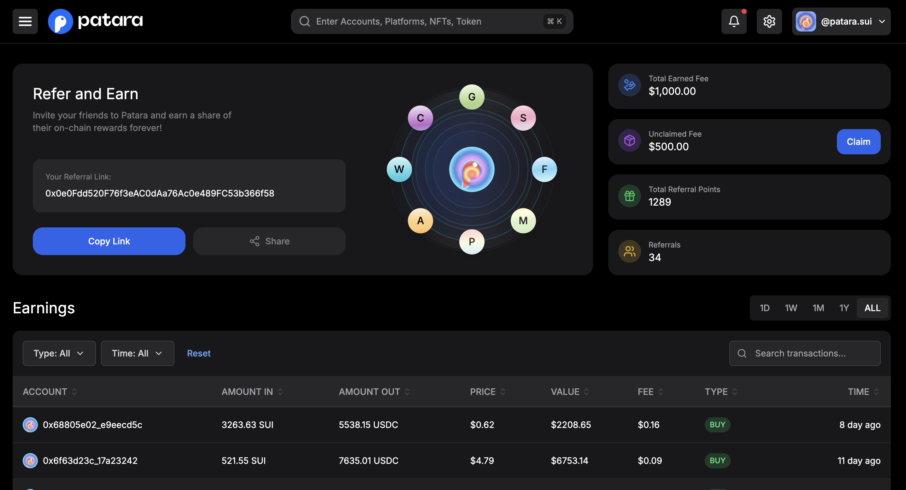
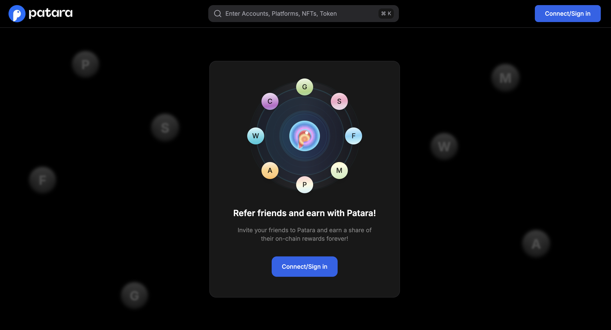
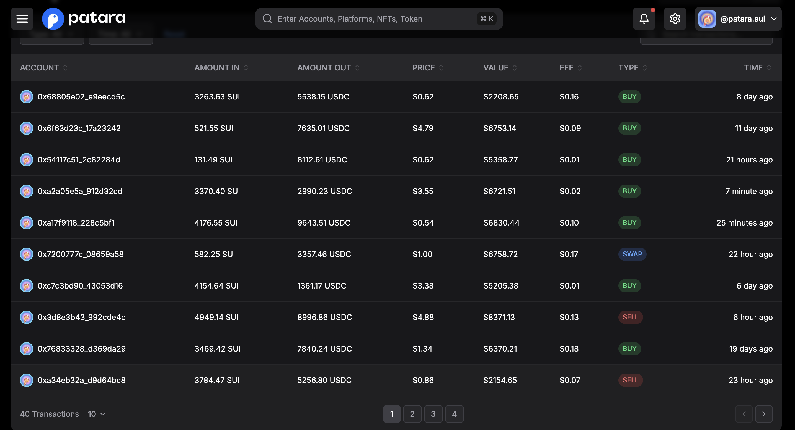
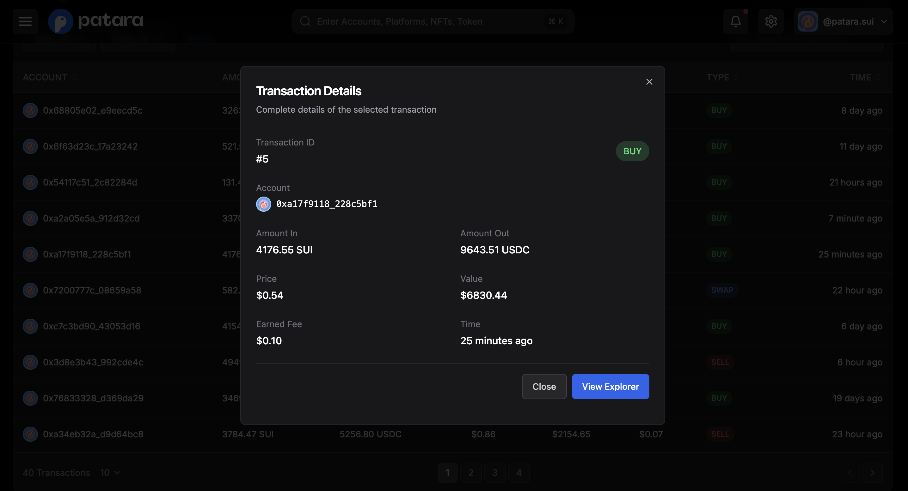
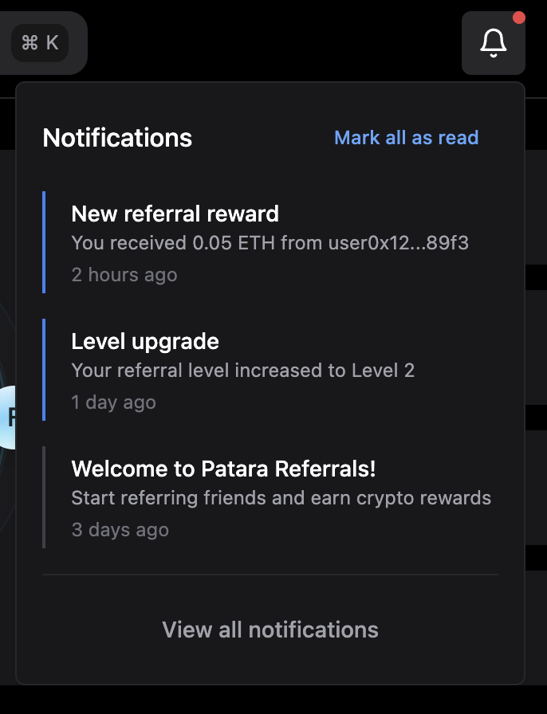
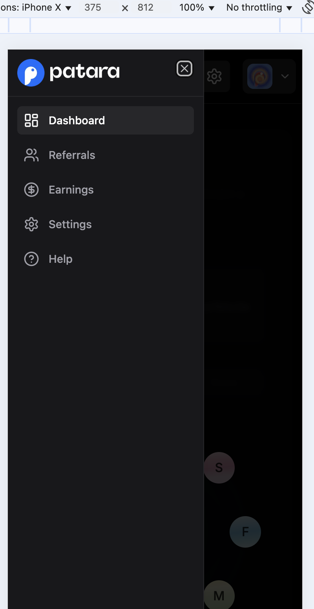
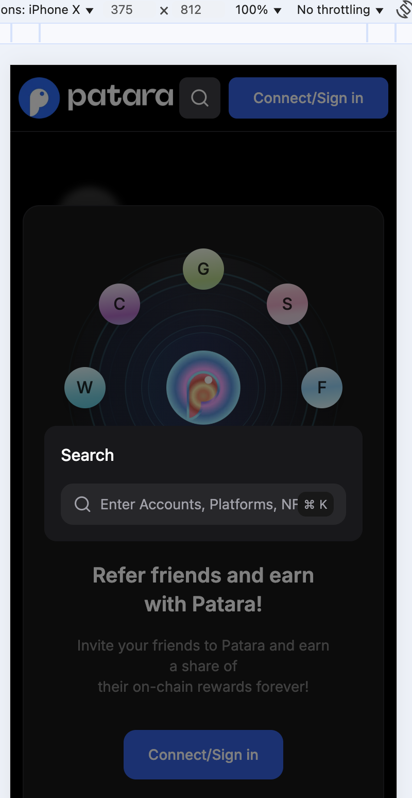
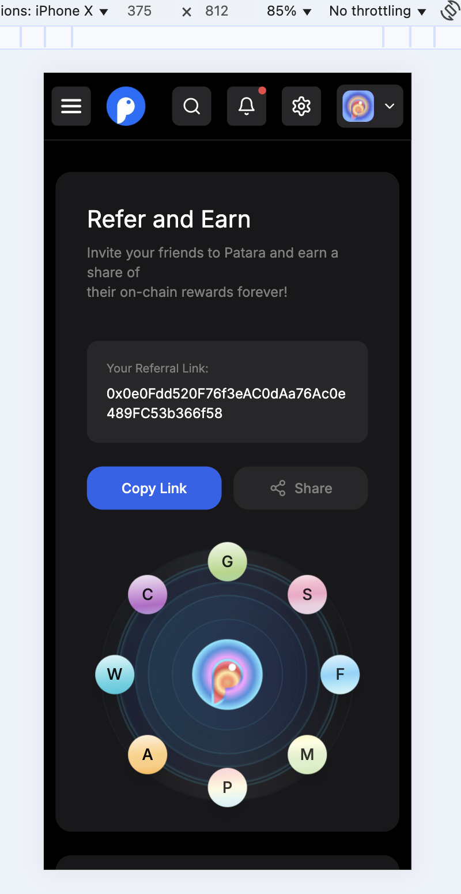
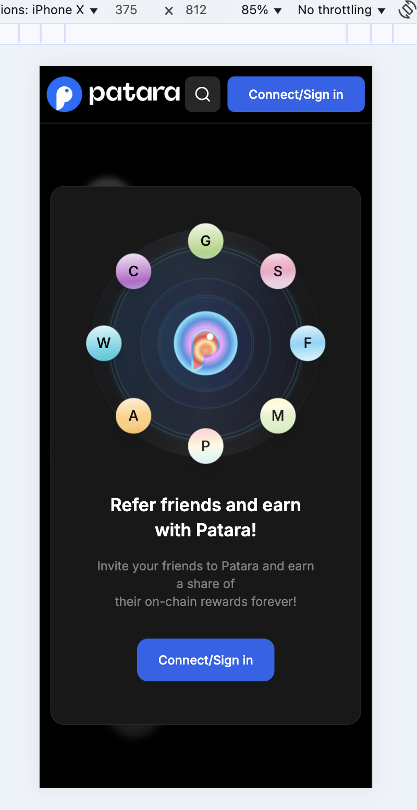

# Patara Referral App

<div align="center">
  
  <h1>Patara - Crypto Referral Platform</h1>
  <p>Earn rewards by referring friends to the Patara platform</p>
  
  <a href="https://patara-referral-app.vercel.app" target="_blank">Live Demo</a>
</div>

## 📋 Overview

Patara is a blockchain-based referral platform that allows users to earn cryptocurrency rewards by referring friends and tracking their on-chain activities. Users can create personalized referral links, monitor their earnings, and claim rewards.

## ✨ Features

- **Personalized Referral Links**: Generate and share unique referral links
- **Earnings Dashboard**: Track all earnings and transaction history
- **Real-time Notifications**: Get notified about new referrals and rewards
- **Referral Statistics**: Monitor your referral performance
- **Transaction Details**: View complete information about each transaction
- **Multi-level Referrals**: Earn from both direct and indirect referrals
- **Reward Claiming**: Claim accumulated rewards with one click
- **Mobile Responsive**: Works seamlessly on all devices

## 🖼️ Screenshots

### User Dashboard


### Login Screen


### Transactions List


### Transaction Details


### Profile


### Notification


### Main Menu


### Search Box


### Dashboard Mobile


### Login Mobile


## 🚀 Technologies Used

- Next.js
- TypeScript
- Tailwind CSS
- Radix UI Components
- Framer Motion
- React Hook Form
- Recharts
- Web3 Integration (for blockchain interactions)

## 🛠️ Installation & Setup

1. **Clone the repository**
   ```bash
   git clone https://github.com/emre15900/patara-referral-app.git
   cd patara-referral-app
   ```

2. **Install dependencies**
   ```bash
   npm install
   # or
   yarn
   ```

3. **Run the development server**
   ```bash
   npm run dev
   # or
   yarn dev
   ```

4. **Open your browser**
   Navigate to [http://localhost:3000](http://localhost:3000)

## 🌐 Deployment

The application is deployed on Vercel:
[https://patara-referral-app.vercel.app](https://patara-referral-app.vercel.app)

## 📦 Project Structure

```
patara-referral-app/
├── components/        # React components
├── hooks/             # Custom React hooks
├── lib/               # Utility functions and helpers
├── pages/             # Next.js pages
├── public/            # Static assets
├── styles/            # CSS and styling files
├── next.config.js     # Next.js configuration
└── package.json       # Project dependencies
```

## 🤝 Contributing

Contributions are welcome! Please feel free to submit a Pull Request.

## 📄 License

This project is licensed under the MIT License - see the LICENSE file for details.

## 🔗 Links

- [Website](https://patara-referral-app.vercel.app)
- [GitHub Repository](https://github.com/emre15900/patara-referral-app)

## 📬 Contact

For any inquiries, please reach out to [emresayinweb@gmail.com](mailto:emresayinweb@gmail.com) 